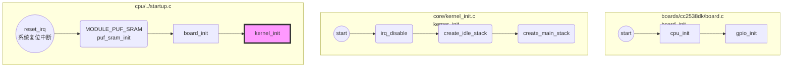

RIOT 启动流程
================

```mermaid
graph TB

    subgraph boardinit["boards/cc2538dk/board.c<br>board_init"]
    start_board_init((start))
    cpu_init[cpu_init]
    gpio_init[gpio_init]

    start_board_init --> cpu_init
    cpu_init --> gpio_init
    end

    subgraph kernelinit["core/kernel_init.c<br>kerner_init"]
    start_kernel_init((start))
    irq_disable(irq_disable)
    create_idle_stack(create_idle_stack)
    create_main_stack(create_main_stack)
    start_kernel_init --> irq_disable
    irq_disable --> create_idle_stack
    create_idle_stack --> create_main_stack
    end

    subgraph startup[cpu/../startup.c]
    reset_irq(("reset_irq <br> 系统复位中断"))
    puf_sram_init(MODULE_PUF_SRAM <br>puf_sram_init)
    board_init[board_init]
    kernel_init[kernel_init]

    reset_irq --> puf_sram_init
    puf_sram_init --> board_init
    board_init --> kernel_init

    style kernel_init fill:#f9f,stroke:#333,stroke-width:4px
    end


```
